# Creative Spark

Responsive visual <b style="color: yellow;">(open here)</b>

## Purpose
Creative Spark is more than just an online marketplace—it’s a celebration of craftsmanship and originality. Built with seamless Stripe integration for secure payments, our platform connects artisans with those who appreciate the beauty of handmade goods. Whether you’re a creator pouring heart and soul into your craft or a discerning shopper looking for one-of-a-kind treasures, Creative Spark offers affordable, unique pieces that elevate everyday life. Our mission is to empower skilled makers, support small businesses, and provide customers with meaningful, high-quality products that tell a story. In a world of mass production, we champion artistry, ensuring that every purchase feels personal, special, and infused with creativity.    

[Creative Bliss live site](https://creative-bliss-7f2ee6904dd8.herokuapp.com/)   
[Creative Bliss Facebook page](https://www.facebook.com/people/Creative-Bliss/61573912296649/)  

## Description [Interactive Responsive E-commerce Website]

**Creative Spark:** Your Go-To Online Craft Store  
Creative Spark is an online marketplace offering unique, handcrafted goods at affordable prices, built to communicate with Stripe for secure payments.  
Unique pieces are imbued with the artisan’s skill, dedication, and creativity, making each item a work of art.  

**Platform Overview**  
Our e-commerce site is designed to provide a seamless shopping experience, allowing customers to explore a curated collection of artisanal jewelry, paintings, souvenirs, and home décor, crafted with passion by skilled artisans.  

**Why Choose Creative Spark?**  
Affordable Prices:  
We believe quality craftsmanship should be accessible to everyone.  

Authentic & Unique Products:  
Each item tells a story and reflects creativity.  

Secure & Convenient Transactions:  
Stripe integration ensures a smooth checkout process.  

Fast & Reliable Delivery:  
Your handcrafted treasures delivered with care.  

Whether you're looking for a personal keepsake, a thoughtful gift, or an artistic addition to your home, Handmade Treasures is your one-stop destination for handcrafted excellence.  

## Target demographics

Creative Spark is designed to appeal to a wide audience.  

By bringing these groups together, Creative Spark creates a space where artistry is celebrated, and customers can connect directly with the heart behind each creation. It’s about fostering appreciation for craftsmanship and making high-quality, original pieces accessible.  

#### 1. Age Groups  
**Millennials & Gen Z (18-35 years old):**  
This group has shown increasing interest in handmade crafts, valuing authenticity, sustainability, and supporting small businesses.  

**Middle-aged buyers (35-55 years old):**  
Often purchase crafts for home décor, gifts, or personal collections.  

**Older buyers (55+ years old):**  
Appreciate craftsmanship and may seek nostalgic or traditional handmade items.  

#### 2. Interests & Motivations  
**Art Enthusiasts & Collectors:**  
Those who appreciate unique, handcrafted designs.  

**Eco-conscious Consumers:**  
Buyers who prefer sustainable, ethically sourced products.  

**Gift Shoppers:**  
People looking for personalized or meaningful gifts.  

**Tourists & Souvenir Seekers:**  
Travelers who want locally made crafts as keepsakes.  

**DIY & Craft Hobbyists:**  
Individuals who enjoy handmade items and may also create their own.  

#### 3. Shopping Behavior  
**Online Shoppers:**  
Many buyers prefer e-commerce platforms for convenience.  

**Local Market Supporters:**  
Some prefer purchasing directly from artisans at craft fairs or boutique stores.  

**Luxury Buyers:**  
Those willing to pay a premium for exclusive, high-quality handmade items.  

## An e-commerce business model

An e-commerce business model for a website that sells handmade, unique art and craft items—such as jewelry, paintings, souvenirs, and more—would likely focus on several key aspects:

#### 1. Business Model Type  
This e-commerce business falls under the Marketplace Model or Direct-to-Consumer (DTC) Model, depending on whether it's allow multiple artists to sell their work or focus solely on personal creations.  

#### 2. Value Proposition  
This website offers customers exclusive, handcrafted products with unique designs and artistic craftsmanship.  
Unlike mass-produced items, these creations have personal touches, cultural significance, and artistry that make them stand out.  

#### 3. Revenue Streams  
Product Sales: Direct purchases of handmade items.  
Commission Model: If hosting multiple artists, it can earn a commission on each sale.  
Subscription Services: A membership model for exclusive early access to new collections or custom-made items.  
Customized Orders: Offering personalized crafts tailored to customer requests.  
Workshops & Digital Downloads: Selling tutorials, craft kits, or artistic courses.  

#### 4. Marketing & Customer Engagement  
SEO & Content Marketing: Blogs, tutorials, and artist stories to engage customers.  
Social Media & Influencer Collaborations: Using Instagram, Pinterest, and TikTok to showcase craftsmanship.  
Loyalty Programs & Discounts: Rewarding repeat customers with perks.  
Email Marketing & Personalized Recommendations: Enhancing customer engagement.  

#### 5. Technology & Platform  
E-Commerce Platform: Python, Django, PostgreSQL, AWS.  
Payment Integration: Secure transactions with Stripe, PayPal or other gateways.  

#### 6. Logistics & Fulfillment  
Handmade Production Workflow: Ensuring quality control and exclusivity.  
Shipping Strategy: Reliable and cost-effective delivery.  
Sustainable Packaging: Eco-friendly wrapping to align with artisanal branding.  

### SEO

- Various SEO techniques were implemented to optimize the site's visibility and achieve a high ranking in search engine results. Additionally, the robots.txt and sitemap.xml files were incorporated, with the sitemap.xml generated using XML Sitemaps.  

- The information and descriptions of the wares, along with other site sections, have been carefully tailored to align with the site's purpose. Additionally, keywords were strategically incorporated into categories and other elements to enhance relevance while ensuring they are naturally integrated, avoiding any risk of being flagged as spam.  

## User Experience

- Users expect a seamless and intuitive navigation system that makes browsing effortless and efficient. The site should be quick and easy to use, ensuring that all links and functions operate as expected without any disruptions. A visually appealing design is crucial, maintaining an attractive and well-structured layout that adapts flawlessly to different screen sizes. Additionally, superusers require the ability to create, view, edit, and delete products and sales with ease, enabling effective management of the platform. Accessibility is also a key consideration, ensuring that all users, regardless of their needs, can navigate and engage with the site comfortably.  

### User Stories
- User Stories created on [GitHub Kanban Board](https://github.com/users/Silver25/projects/7)  
  

- User needs successfully addressed through the development of specific applications in this project:

- USER STORY: 404 page  
- USER STORY: User Registration
- USER STORY: Responsiveness
- USER STORY: User account
- USER STORY: User LogIn-LogOut
- USER STORY: Contact Form
- USER STORY: Main Home Page
- USER STORY: Account status visibility
- USER STORY: About page
- USER STORY: View Products Listing
- USER STORY: Shopping Cart
- USER STORY: Stripe Payment
- USER STORY: User Profile Page
- USER STORY: Store Management
- USER STORY: Product page
- USER STORY: Recover Password
- USER STORY: Site Map
- USER STORY: Search Product
- USER STORY: View Items in Basket
- USER STORY: View Order Confirmation
- USER STORY: Add a Product
- USER STORY: Edit/Update a Product
- USER STORY: Delete a Product
- USER STORY: Main Top Navigation
- USER STORY: Project Base Template
- USER STORY: Choose a Category of products
- USER STORY: Sort the list of products
- USER STORY: Select the quantity for purchase
- USER STORY: User payment information

## Design

The webpage was crafted with a minimalist, sleek, and contemporary aesthetic to ensure a clean and user-friendly experience.  

### Colour Scheme

- The e-commerce design embraces a monochromatic black-and-white palette, creating a sleek and modern aesthetic that prioritizes simplicity and clarity. By eliminating distractions, this minimalist approach enhances the user experience, ensuring seamless navigation and a refined shopping environment.

### Wireframes

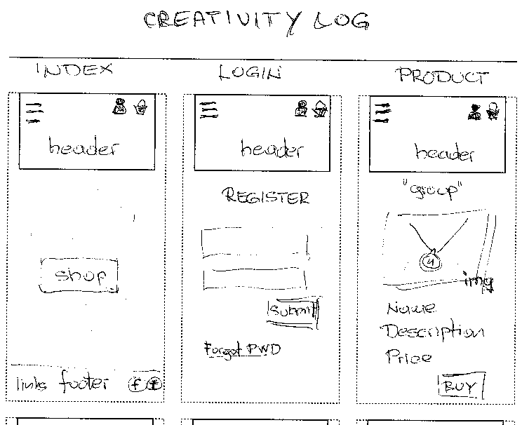  
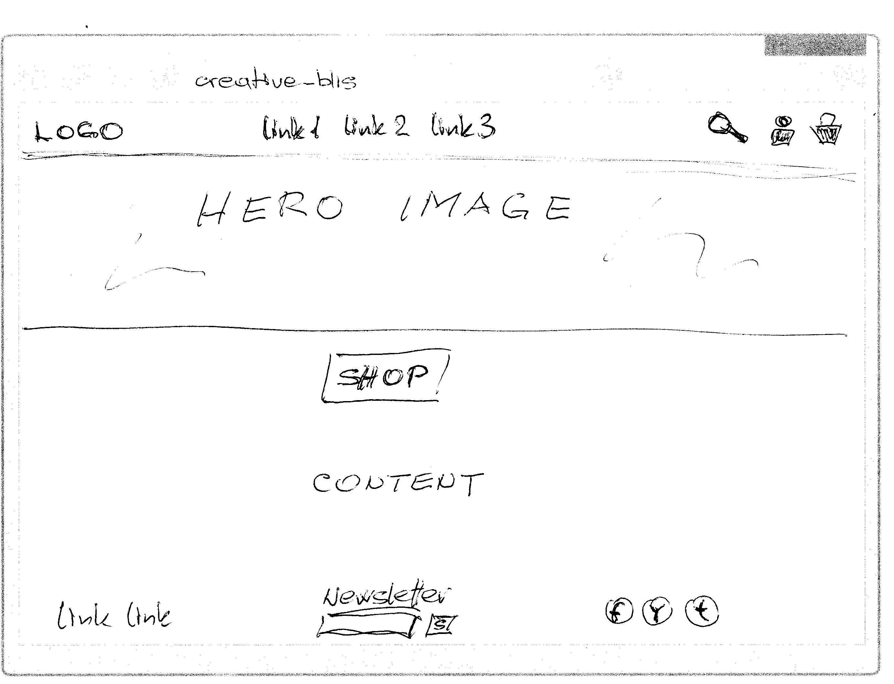  

## Features

### Existing Features

- __Top Navigation Bar__  

  

  - Featured on all pages, the full responsive navigation bar includes links to the Logo, Home page, Shopping page and Sign Up/Register page and is identical in each page to allow for easy navigation.
  - This section will allow the user to easily navigate from page to page across all devices without having to revert back to the previous page via the ‘back’ button. 

- __The Hero image__  

  

  - The landing includes a photograph with text overlay to allow the user to see exactly which location this site would be applicable to. 
  - This section introduces the visitor to web shop site to grab their attention  

- __The Footer__  

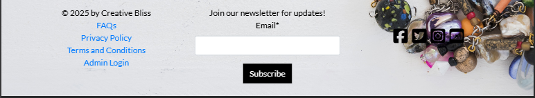

  - The footer section includes links to the relevant social media sites. The links will open to a new tab to allow easy navigation for the user, and keeping web shop page active. 
  - The footer is valuable to the user as it encourages them to keep connected via social media and newsletter.  

- __Products listing__  

  - The gallery of products will provide the user with supporting images to see what is offered. 
  - This section is valuable to the user as they will be able to easily identify the types of items the shop puts together.  

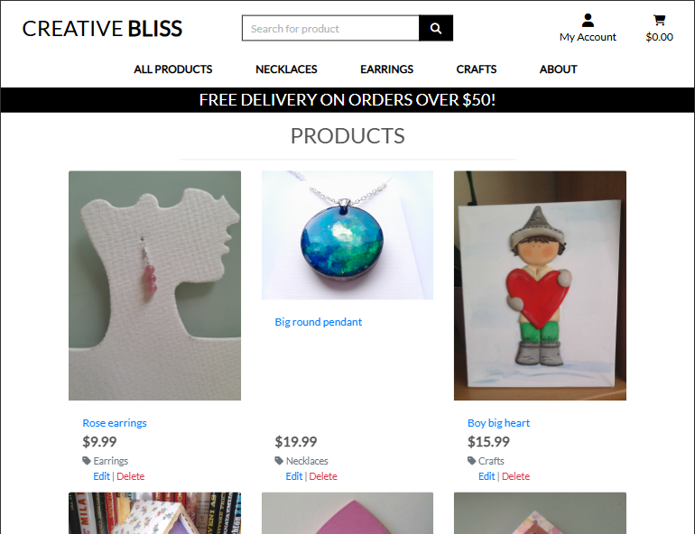  

- __The Sign Up/Register Page__  

  - This page will allow the user to get signed up to shop to start their shopping experience with the offers. The user will be able specify within price and categories. The user will be asked to submit their full name and email address to create personal page. 

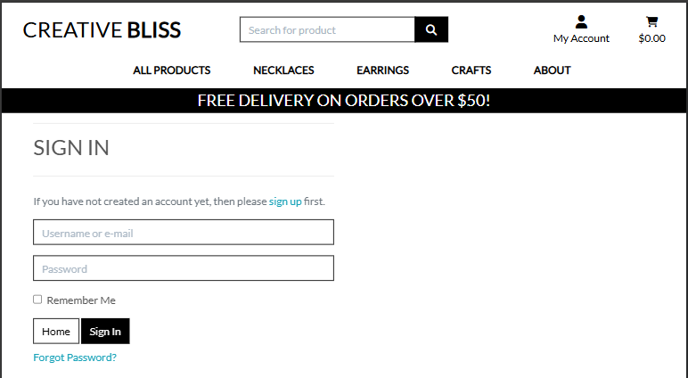  

- __Personal details Page__  

  - This page saves personal information on one place, for registered user to have preview of orders history. 
  Also displays a form with option for user to change/update personal information.  

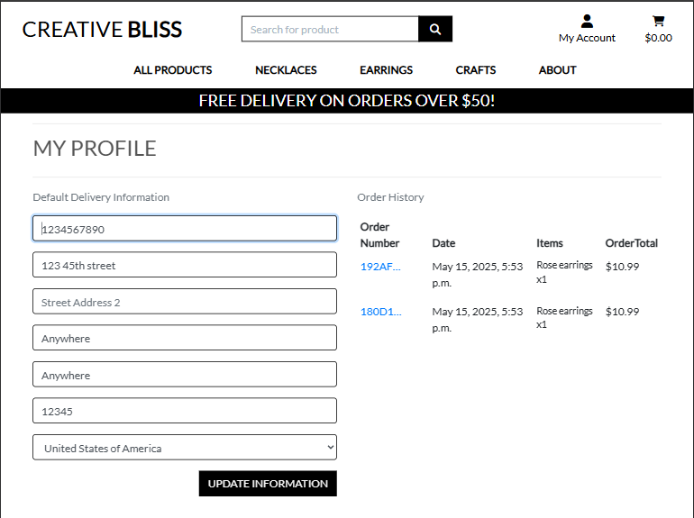  

- __Single item/product Page__  

  - This page provides users with a clear, detailed view of a specific product, allowing them to evaluate its features, price, and availability before making a purchase. This dedicated page enhances user experience by offering essential product information, images, and purchasing options, making the decision process smooth and intuitive.  

  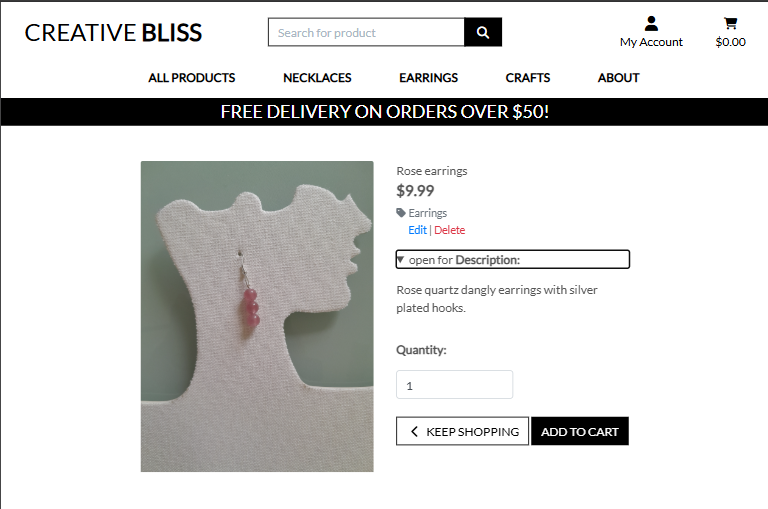  

  - __Shopping cart Page__  

  - This page allows users to review their selected items, adjust quantities, and ensure they have everything they need before proceeding to checkout. This essential feature streamlines the purchasing process by providing a clear overview of the order, minimizing errors, and enhancing convenience for a seamless transaction.  

  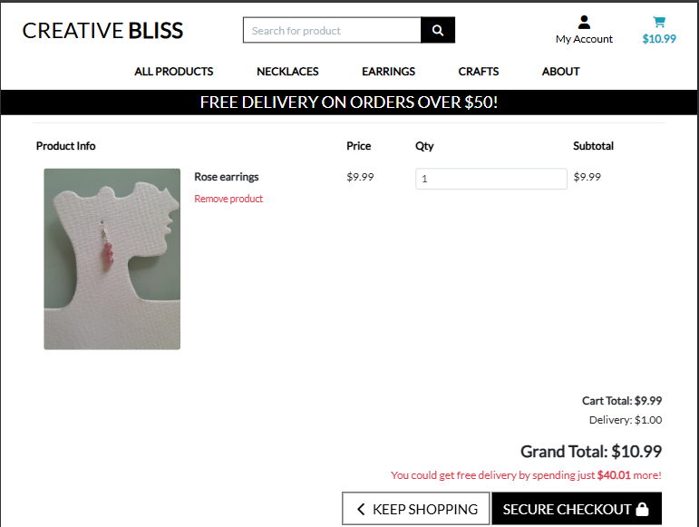  

  - __Checkout Page__  

  - This page is crucial as it allows users to securely enter their personal details, shipping information, and payment preferences in one streamlined form. Integrated with Stripe, this page ensures a smooth and trustworthy transaction process, providing a hassle-free experience while maintaining security and reliability.  

  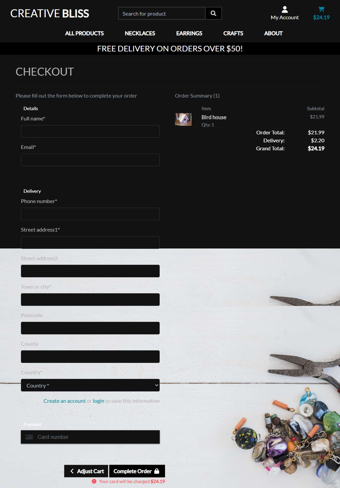  

  - __FAQs Page__  

  - This page provides users with quick access to essential information about products, materials, and craftsmanship, helping them make informed purchasing decisions. By answering common questions in one convenient location, this page enhances user confidence, reduces uncertainty, and improves overall shopping experience.  

  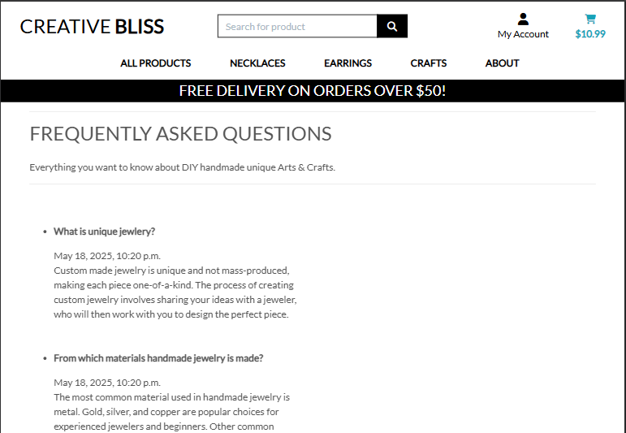  

  - __About web shop Page__  

  - This page is prepared for filling with content to present some informations about web shop, to be handle from Admin interface.  

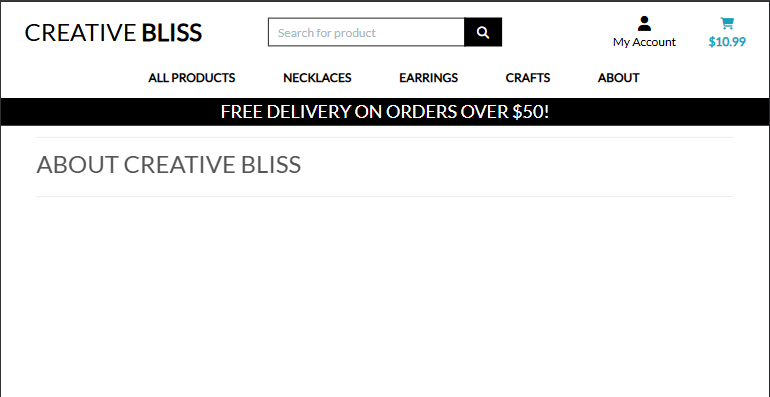  

- __The Sign out/Logoff Page__  

  - This page will allow the user to leave personal information when finished with the shopping experience.  

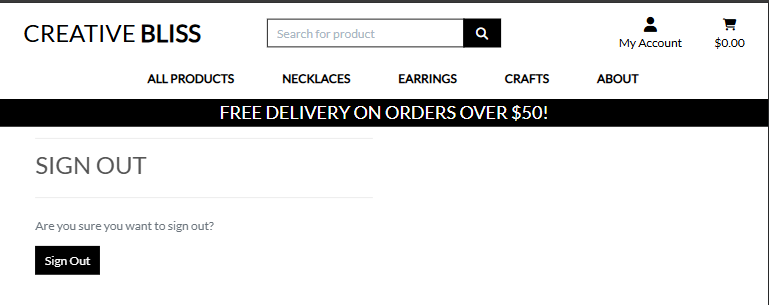  

### Features Left to Implement

- 'Add to Cart' feature for single/unique product to send to Cart, without quantity option  
- 'Wish list' feature for creating list of products for future buying  
- 'Feedback' page for registered users to leave comment  

## Testing and Bugs

- Results of testing or bugs that appear available on another file [Testing.md file](Testing.md) 

## Deployment

### Technology

**Django Web Framework:**  
Ensures a fast, secure, and scalable backend to power product listings, user accounts, and order management.  

**PostgreSQL Database:**  
A reliable, high-performance relational database to store product information, customer orders, and transaction history.  

**Stripe Payment Gateway:**  
Enables secure online payments, supporting multiple currencies and transaction methods.  

### Local Deployment
- Install Python 3.12
- Clone of the GutHub repo to local environment
- Create virtual environment with Python 3.12 [to support Django 3.2.25]
- Create new project 'Boutique' with command: django-admin startproject boutique .
- Test installation within the browser, running Django server with command: python manage.py runserver
 
- Update .gitignore file with *.sqlite3, *.pyc, env.py and __pycache__
- Run the initial migrations with: python manage.py migrate to populate dev db
- Create superuser for access to Admin area

- The live page on the location: [Creative Bliss live site](https://creative-bliss-7f2ee6904dd8.herokuapp.com/)

### Cloud Deployment

**Create Heroku app**  
- create an account, access to Dashboard, with the 'new button' select create a 'new app'
- choose a name for the app, which must be unique, select the region, click 'create app'
- connect Heroku app with GitHub project, create Config Vars to hold keys from env.py file
- Enable Automatic deploys so a chosen branch to be automatically deployed to this app
- deploy branch, open new tab with running app over the button 'view app'
- use Heroku Console if changes are made after connection on PostgreSQL db, rerun migrate  

**Create PostgreSQL database**  
- access to CI link https://dbs.ci-dbs.net and follow instructions
- new created db link will be sent to email, that link goes in Config vars on Heroku  

**Stripe payment**  
- create account with Stripe and follow CI procedure for creating public/secret keys
- dashboard using test elements for fake/learning transactions

**AWS S3 bucket**  
- create an account on AWS
- follow detailed CI instructions for creating group, users, folder for static files

## Credits 

- https://docs.djangoproject.com/en/5.1/intro/tutorial01/  
- https://www.askpython.com/django/django-app-structure-project-structure  
- https://dev.to/digvijay_singhrajput/django-file-structure-for-developers-4i68  
- https://github.com/orgs/Code-Institute-Submissions/repositories
- https://github.com/asweigart
- https://www.geeksforgeeks.org/  
- https://useful.codes/django-tutorial/
- https://www.w3schools.com/   
- https://en.wikipedia.org/wiki/Main_page
- https://www.parabol.co/blog/user-story-examples/

### Content 

- The text for some product details adjusted from a [Wikipedia](https://www.wikipedia.org/) articles
- Some content used from web site: https://digestley.com/
- Instruction for some Django tags used from [Specific YouTube Tutorial](https://www.youtube.com/)
- Tutorial related to Django project from: https://medium.com/django-unleashed/complete-django-project-setup-a-comprehensive-guide-289182b75f3c
- The icons on the site were taken from [Font Awesome](https://fontawesome.com/)
- Text conversion to ASCII art with https://patorjk.com/software/taag/

### Media

- The main header image used for the dev page taken from [Freepik](https://www.freepik.com/free-photo/many-colorful-beads-plier-wooden-desk_4635908.htm)
- Product images under copyright of my wife

### Tools

- MS Windows 11 Pro with activated Sandbox tool - testing installations and setup of new apps or services
- Microsoft [Visual Studio Code](https://code.visualstudio.com/) - as a great companion and helper through 'valley of the coding'
- Heroku - The AI PaaS For Deploying, Managing, and Scaling Apps
- AWS - AWS with services to help build sophisticated applications
- Stripe - Financial infrastructure to grow revenue
- [Temporary Email Address](https://temp-mail.org/en/) - for testing purposes
- [WinMerge](https://winmerge.org/?lang=en) is an Open Source differencing and merging tool - Text comparison
- [Google Translate](https://translate.google.com/) - translation of the text
- [GrammarCheck](https://www.grammarcheck.net/editor/) - internet's first online grammar checker
- [Perplexity](https://www.perplexity.ai/) - answer engine, searches the internet to deliver fast, clear answers
- [IrfanView](https://www.irfanview.com/) - one of the most popular viewers wrldwide, and really fast helper
- [Quillbot](https://quillbot.com/grammar-check) - free online AI grammar checker tool  

### Acknowledgements

- My course mentor Rory Patrick Sheridan keeping me on my path.
- Group leader/Cohort Facilitator Lewis Dillon for tips and trics to help us survive.
- Tutors, students and Slack Community from Code Institute for their assistance and support.
- To Developer society all around the world (and YouTube videos)
