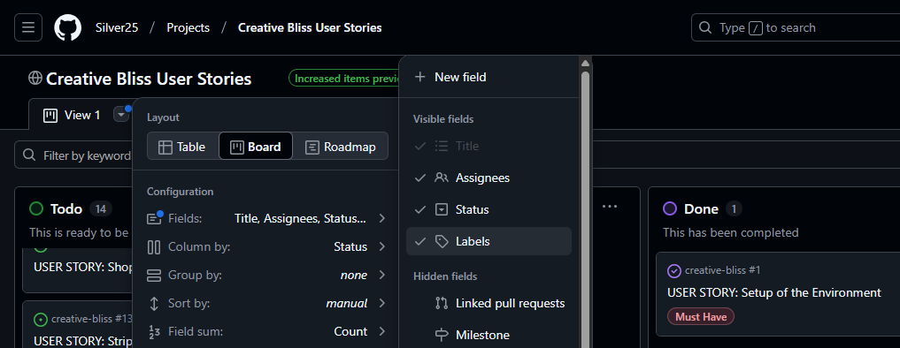
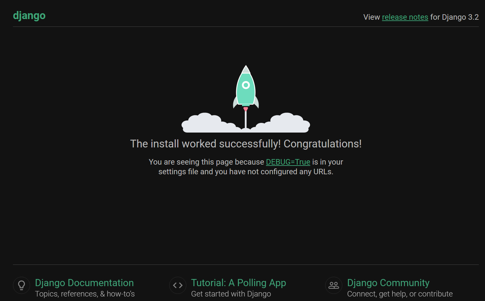

# Project Title

Responsive visual <b style="color: yellow;">(open here)</b>

## Purpose
In this section, you will include one or two paragraphs providing an overview of your project.  
Essentially, this part is your sales pitch. At this stage, you should have a name for your project so use it!  
Don’t introduce the project as a Portfolio project for the diploma.  
In this section, describe what the project hopes to accomplish, who it is intended to target and how it will be useful to the target audience.  

[Creative Bliss live site](https://creative-bliss-7f2ee6904dd8.herokuapp.com/)  
[Creative Bliss Facebook page](https://www.facebook.com/people/Creative-Bliss/61573912296649/)  

## Description [Interactive Responsive E-commerce Website]

**Creative Bliss:** Your Go-To Online Craft Store  
Creative Bliss is an online marketplace offering unique, handcrafted goods at affordable prices, built to communicate with Stripe for secure payments.  

**Platform Overview**  
Our e-commerce site is designed to provide a seamless shopping experience, allowing customers to explore a curated collection of artisanal jewelry, paintings, souvenirs, and home décor, crafted with passion by skilled artisans.  

**Why Choose Creative Bliss?**  
Affordable Prices:  
We believe quality craftsmanship should be accessible to everyone.  

Authentic & Unique Products:  
Each item tells a story and reflects creativity.  

Secure & Convenient Transactions:  
Stripe integration ensures a smooth checkout process.  

Fast & Reliable Delivery:  
Your handcrafted treasures delivered with care.  

Whether you're looking for a personal keepsake, a thoughtful gift, or an artistic addition to your home, Handmade Treasures is your one-stop destination for handcrafted excellence.  

## Target demographics

Handmade craft buyers tend to fall into several key demographic groups, each with distinct motivations and purchasing behaviors:  

#### 1. Age Groups  
**Millennials & Gen Z (18-35 years old):**  
This group has shown increasing interest in handmade crafts, valuing authenticity, sustainability, and supporting small businesses.  

**Middle-aged buyers (35-55 years old):**  
Often purchase crafts for home décor, gifts, or personal collections.  

**Older buyers (55+ years old):**  
Appreciate craftsmanship and may seek nostalgic or traditional handmade items.  

#### 2. Interests & Motivations  
**Art Enthusiasts & Collectors:**  
Those who appreciate unique, handcrafted designs.  

**Eco-conscious Consumers:**  
Buyers who prefer sustainable, ethically sourced products.  

**Gift Shoppers:**  
People looking for personalized or meaningful gifts.  

**Tourists & Souvenir Seekers:**  
Travelers who want locally made crafts as keepsakes.  

**DIY & Craft Hobbyists:**  
Individuals who enjoy handmade items and may also create their own.  

#### 3. Shopping Behavior  
**Online Shoppers:**  
Many buyers prefer e-commerce platforms for convenience.  

**Local Market Supporters:**  
Some prefer purchasing directly from artisans at craft fairs or boutique stores.  

**Luxury Buyers:**  
Those willing to pay a premium for exclusive, high-quality handmade items.  

## An e-commerce business model

An e-commerce business model for a website that sells handmade, unique art and craft items—such as jewelry, paintings, souvenirs, and more—would likely focus on several key aspects:

#### 1. Business Model Type  
This e-commerce business falls under the Marketplace Model or Direct-to-Consumer (DTC) Model, depending on whether it's allow multiple artists to sell their work or focus solely on personal creations.  

#### 2. Value Proposition  
This website offers customers exclusive, handcrafted products with unique designs and artistic craftsmanship.  
Unlike mass-produced items, these creations have personal touches, cultural significance, and artistry that make them stand out.  

#### 3. Revenue Streams  
Product Sales: Direct purchases of handmade items.  
Commission Model: If hosting multiple artists, it can earn a commission on each sale.  
Subscription Services: A membership model for exclusive early access to new collections or custom-made items.  
Customized Orders: Offering personalized crafts tailored to customer requests.  
Workshops & Digital Downloads: Selling tutorials, craft kits, or artistic courses.  

#### 4. Marketing & Customer Engagement  
SEO & Content Marketing: Blogs, tutorials, and artist stories to engage customers.  
Social Media & Influencer Collaborations: Using Instagram, Pinterest, and TikTok to showcase craftsmanship.  
Loyalty Programs & Discounts: Rewarding repeat customers with perks.  
Email Marketing & Personalized Recommendations: Enhancing customer engagement.  

#### 5. Technology & Platform  
E-Commerce Platform: Python, Django, PostgreSQL, AWS.  
Payment Integration: Secure transactions with Stripe, PayPal or other gateways.  

#### 6. Logistics & Fulfillment  
Handmade Production Workflow: Ensuring quality control and exclusivity.  
Shipping Strategy: Reliable and cost-effective delivery.  
Sustainable Packaging: Eco-friendly wrapping to align with artisanal branding.  

## User Stories
- User Stories created on [GitHub Kanban Board](https://github.com/users/Silver25/projects/7)  

## Technology & Features

**Django Web Framework:**  
Ensures a fast, secure, and scalable backend to power product listings, user accounts, and order management.  

**PostgreSQL Database:**  
A reliable, high-performance relational database to store product information, customer orders, and transaction history.  

**Stripe Payment Gateway:**  
Enables secure online payments, supporting multiple currencies and transaction methods.  

**User-Friendly Interface:**  
Simple and intuitive design for browsing, adding items to cart, and completing purchases hassle-free.  

**Order Tracking & Reliable Delivery:**  
Customers receive updates from checkout to delivery, ensuring satisfaction.  

### Existing Features

- __Navigation Bar__

  - Featured on all three pages, the full responsive navigation bar includes links to the Logo, Home page, Gallery and Sign Up page and is identical in each page to allow for easy navigation.
  - This section will allow the user to easily navigate from page to page across all devices without having to revert back to the previous page via the ‘back’ button. 

- __The landing page image__

  - The landing includes a photograph with text overlay to allow the user to see exactly which location this site would be applicable to. 
  - This section introduces the user to Love Running with an eye catching animation to grab their attention

- __Club Ethos Section__

  - The club ethos section will allow the user to see the benefits of joining the Love Running meetups, as well as the benefits of running overall. 
  - This user will see the value of signing up for the Love Running meetups. This should encourage the user to consider running as their form of exercise. 

- __Meetup Times section__

  - This section will allow the user to see exactly when the meetups will happen, where they will be located and how long the run will be in kilometers. 
  - This section will be updated as these times change to keep the user up to date. 

- __The Footer__ 

  - The footer section includes links to the relevant social media sites for Love Running. The links will open to a new tab to allow easy navigation for the user. 
  - The footer is valuable to the user as it encourages them to keep connected via social media

- __Gallery__

  - The gallery will provide the user with supporting images to see what the meet ups look like. 
  - This section is valuable to the user as they will be able to easily identify the types of events the organisation puts together. 

- __The Sign Up Page__

  - This page will allow the user to get signed up to Love Running to start their running journey with the community. The user will be able specify if they would like to take part in road, trail or both types of running. The user will be asked to submit their full name and email address. 

For some/all of your features, you may choose to reference the specific project files that implement them.

In addition, you may also use this section to discuss plans for additional features to be implemented in the future:

### Features Left to Implement

- 'Add to Cart' feature for single product to send to Cart, without quantity option 

## Testing and Bugs

- Results of testing or bugs that appear available on another file [Testing.md file](Testing.md) 

## Deployment

### Local Deployment
- Install Python 3.12
- Clone of the GutHub repo to local environment
- Create virtual environment with Python 3.12 [to support Django 3.2.25]
- Create new project 'Boutique' with command: django-admin startproject boutique .
- Test installation within the browser, running Django server with command: python manage.py runserver
 
- Update .gitignore file with *.sqlite3, *.pyc and __pycache__
- Run the initial migrations with: python manage.py migrate to populate dev db
- Create superuser for access to Admin area

- The live page on the location: https://github.com/Silver25/

### Cloud Deployment
- On Heroku create a new config variable 'EMAIL_HOST_PASS' and use Google app pwd as an value
- Create variable 'EMAIL_HOST_USER' with Google email address as a value

## Credits 

https://docs.djangoproject.com/en/5.1/intro/tutorial01/  
https://www.askpython.com/django/django-app-structure-project-structure  
https://dev.to/digvijay_singhrajput/django-file-structure-for-developers-4i68  
https://www.geeksforgeeks.org/how-to-create-an-app-in-django/  
 

### Content 

- The text for some product details adjusted from a [Wikipedia](https://www.wikipedia.org/) articles
- Instruction for some Django tags used from [Specific YouTube Tutorial](https://www.youtube.com/)
- The icons on the site were taken from [Font Awesome](https://fontawesome.com/)

### Media

- The main header image used for the dev page taken from: <a href="https://www.freepik.com/free-photo/many-colorful-beads-plier-wooden-desk_4635908.htm"> freepik</a>

### Tools

- Microsoft [Visual Studio Code](https://code.visualstudio.com/) - as a great companion and helper through 'valley of the coding'
- [Temporary Email Address](https://temp-mail.org/en/) - for testing purposes
- [WinMerge](https://winmerge.org/?lang=en) is an Open Source differencing and merging tool - Text comparison
- [Google Translate](https://translate.google.com/) - translation of the text
- [GrammarCheck](https://www.grammarcheck.net/editor/) - internet's first online grammar checker
- [Perplexity](https://www.perplexity.ai/) - answer engine, searches the internet to deliver fast, clear answers
- [IrfanView](https://www.irfanview.com/) - one of the most popular viewers wrldwide, and really fast helper
- [Quillbot](https://quillbot.com/grammar-check) - free online AI grammar checker tool