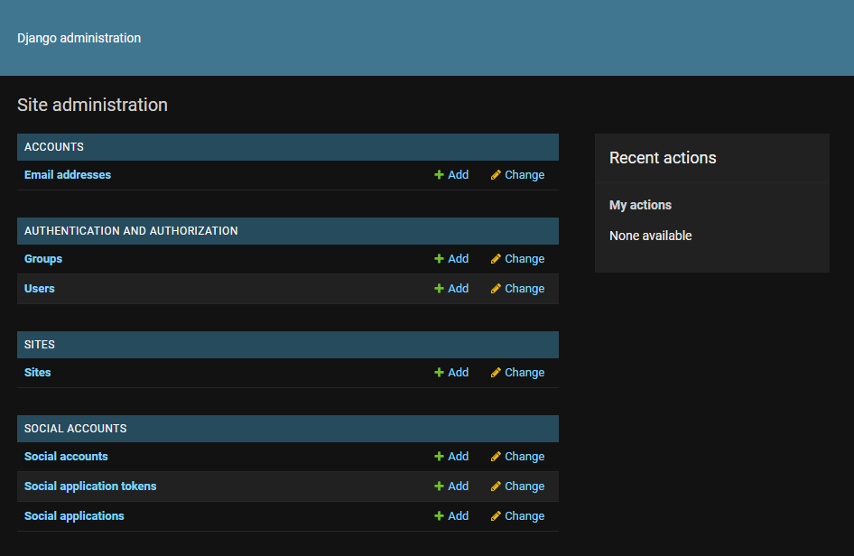
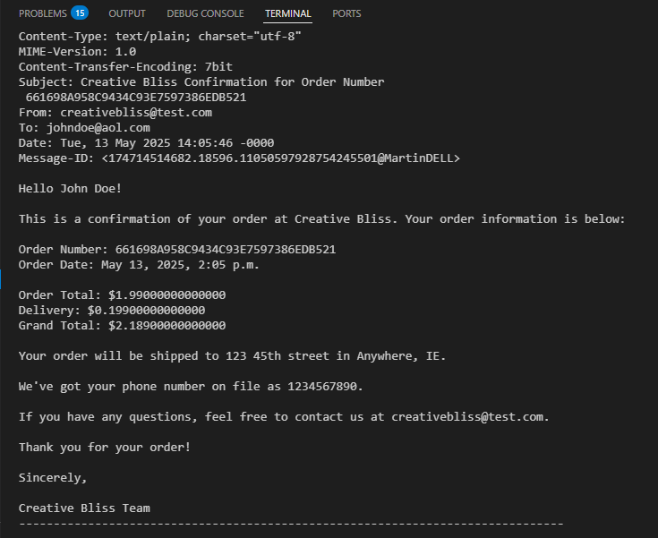
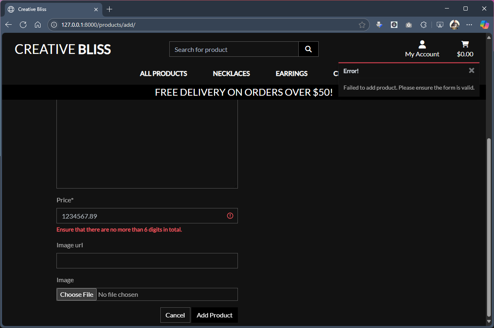
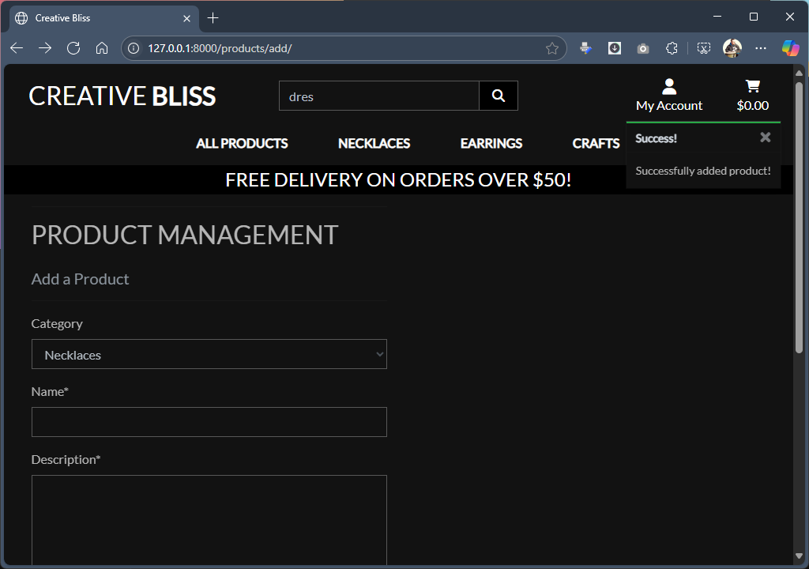
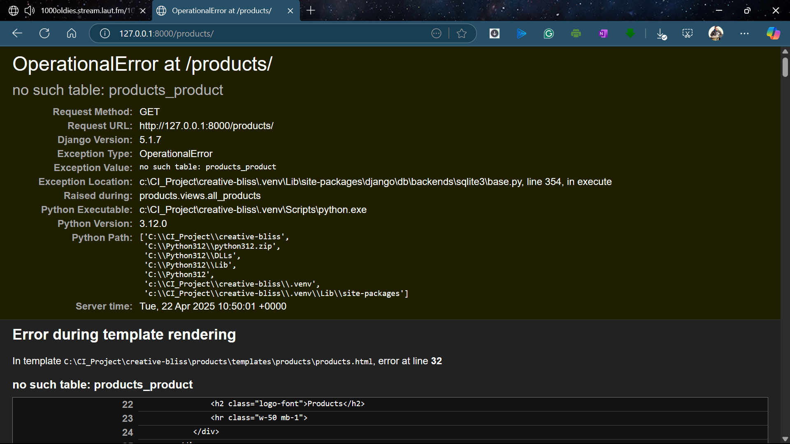
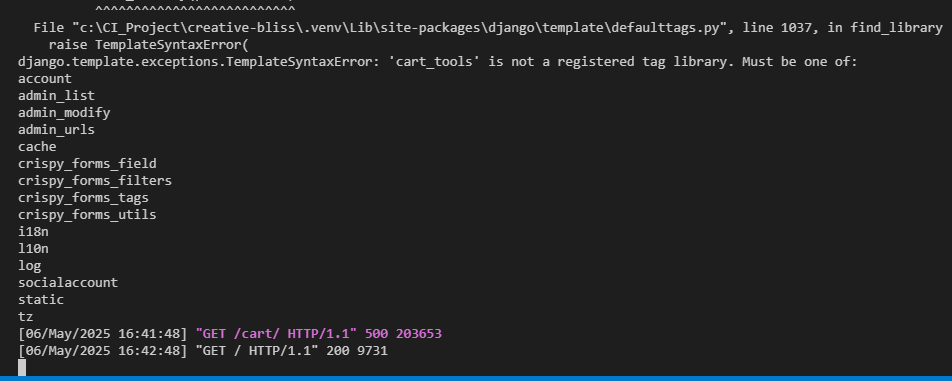
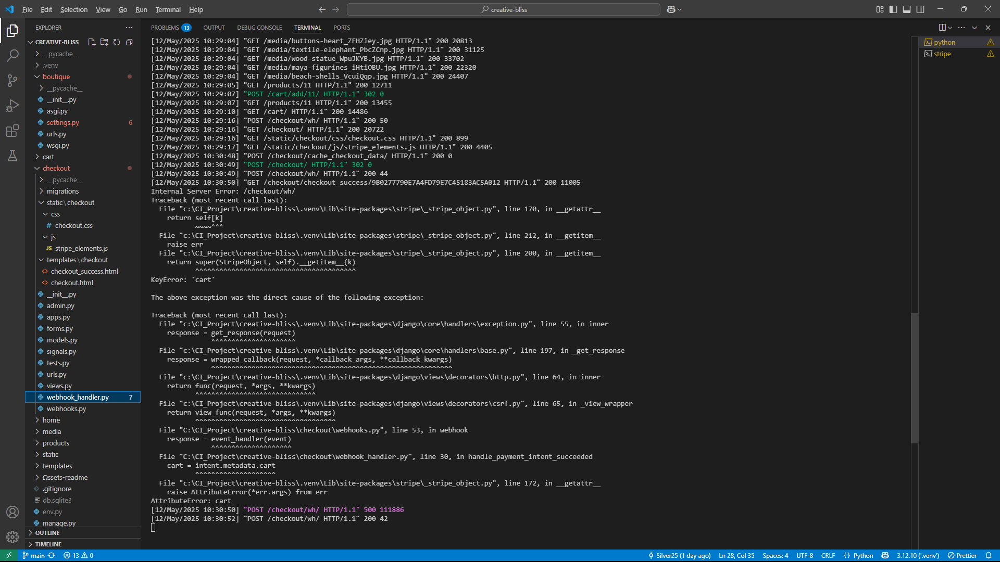
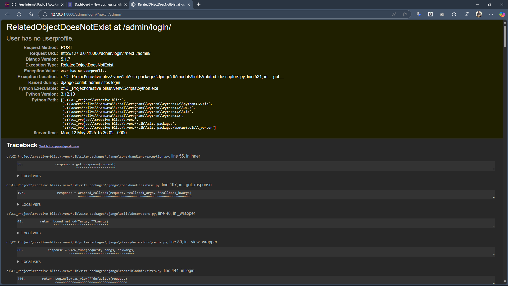
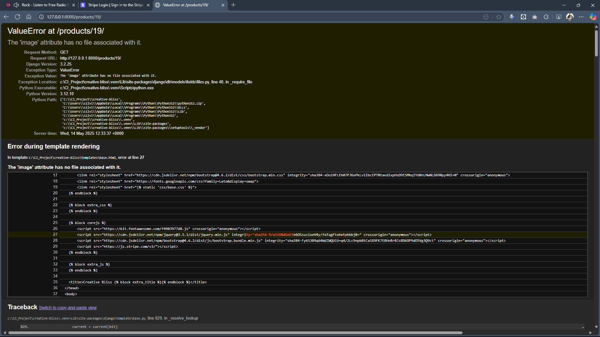

## Testing 

### Manual Testing process

The manual testing of a website can be a simple procedure, involving the access of a web page or application within a controlled setting, systematically navigating through a set of predefined test scenarios, and documenting the results of each test in a spreadsheet. This fundamental method is often utilized by software teams as they first emphasize quality assurance.

Primarily, a foundational understanding of the Python environment and Django templating, along with knowledge of HTML elements and CSS properties, is advantageous for recognizing and resolving potential issues.

**Testing Process:**  
- *Tested Code*:  
- Project was started as a Python code with Django framework to be used for templating and administration of applications  

- After every new function, variable or template tag, testing was provided through checking result with running server
- Setup of Project 'Boutique' and creating Superuser to be able to access Admin area

- Installation of the Allauth app and required fields in the Admin area

- *Tested Content*: 
- Before adding actual content, inserted some test content into HTML file and run it in web browser to ensure that the code is working as expected.
- First draft of the Home page for Django e-commerce project to test functionality of the code, views, urls and related wireing in settings.py file

- *User Interface (UI)*: 
- Verified the layout, visual design, and overall user experience. Checked for consistent formatting, proper image loading, and readability across different screen sizes.
- *Readability*: 
- Examined displayed text (font family, font size, color contrast).
- *Navigation*: 
- Tested all navigation elements like menus, buttons, and links. Ensured they lead to the correct destination pages and function smoothly.
- *Forms & Functionality*: 
- Tested form (contact) to be sure it submit data correctly, provide clear error messages for invalid inputs, and follow expected functionalities, sending data.
- *Content Accuracy*: 
- Reviewed all website content for accuracy, grammar, and spelling mistakes. Verified that descriptions and other information are up-to-date and consistent.
- *Responsiveness*: 
- Validated responsiveness of the website loading Dev Tools option of split screen and resized the browser window across different browsers.
- *Feature - email confirmation*
- Email confirmation for the order, sent to Terminal

- *Feature - Product Management*
- Add product feature for Admin raised Error message with too long price value

- Add product feature - success message

---

### Validator Testing 

- HTML
  - No errors were returned when passing through the official [W3C validator](https://validator.w3.org/nu/?doc=https%3A%2F%2Fcode-institute-org.github.io%2Flove-running-2.0%2Findex.html)
- CSS
  - No errors were found when passing through the official [(Jigsaw) validator](https://jigsaw.w3.org/css-validator/validator?uri=https%3A%2F%2Fvalidator.w3.org%2Fnu%2F%3Fdoc%3Dhttps%253A%252F%252Fcode-institute-org.github.io%252Flove-running-2.0%252Findex.html&profile=css3svg&usermedium=all&warning=1&vextwarning=&lang=en#css)
- Lighthouse: **https://pagespeed.web.dev/**  
- Lighthouse is an open-source, automated Audit tool for improving the quality of web pages. You can run it against any web page, public or requiring authentication. It has audits for performance, accessibility, progressive web apps, SEO, and more. Lighthouse is integrated directly into the Chrome DevTools, under the "Lighthouse" panel.  
- Lighthouse metrics:

- JavaScript: **https://www.jshint.com/**
- Python: **https://pep8ci.herokuapp.com/**

## Bugs and Fixtures

- Missing table to display 'Products' page, RESOLVED with migrations to create tables in DB.

- Error because 'cart_tools' is not a registered as a tag library, when try to access 'checkout' page

- AttributeError 'cart' - event_handler event displays, even after processed order, RESOLVED changing view 'cache_checkout_data' wrong name

- RelatedObjectDoesNotExist error - new app 'profiles' overrides existing superuser profile with try out of saving unknown profile
- Error RESOLVED with created new superuser and deleted old one

- Error 'The 'image' attribute has no file associated with it.' raised when try to open new added product without image
- RESOLVED with replacing Django tags between 'image' and 'no-image' references

### Unfixed Bugs

You will need to mention unfixed bugs and why they were not fixed. This section should include shortcomings of the frameworks or technologies used. Although time can be a big variable to consider, paucity of time and difficulty understanding implementation is not a valid reason to leave bugs unfixed.